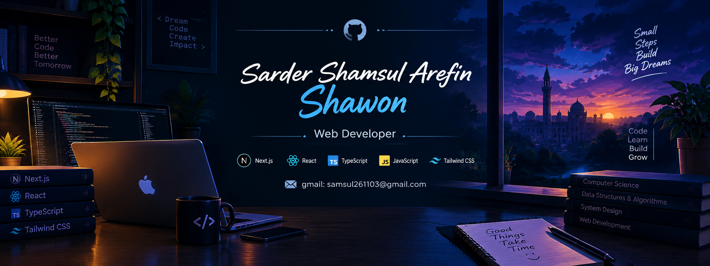

  

<!-- ======================= INTRO ======================= -->

<h1 align="center">Hi 👋, I'm Sarder Shamsul Arefin Shawon</h1>

  

---

## 👨‍💻 About Me

I'm a Computer Science and Engineering student and an aspiring Web Developer who enjoys turning ideas into modern, user-friendly web applications.

I'm currently focused on frontend and full-stack web development, while continuously improving my problem-solving and software development skills.

### 🚀 What I'm Currently Doing

- 🔭 Building modern web applications with **Next.js and TypeScript** .
- 🌱 Exploring **React, Next.js, TypeScript, and full-stack development** .
- 💻 Working on responsive and interactive web projects .
- 📚 Continuously improving my programming and problem-solving skills .
- 🎯 Building projects to strengthen my real-world development experience .

---
<!-- ======================= TECH STACK ======================= -->

## 🛠️ Tech Stack

### 💻 Languages

  

### ⚛️ Frontend & Frameworks

  

### 🗄️ Databases

  

### ☁️ Cloud & Deployment

  

------------------------------

## 🌐 Connect With Me

---------------------------------------------------------------------------------------------

<!-- ======================= GITHUB STATS ======================= -->

# 📊 GitHub Stats:

  

  

<!-- ======================= PROFILE VIEWS ======================= -->

  

---

<!-- Proudly created with GPRM ( https://gprm.itsvg.in ) -->
